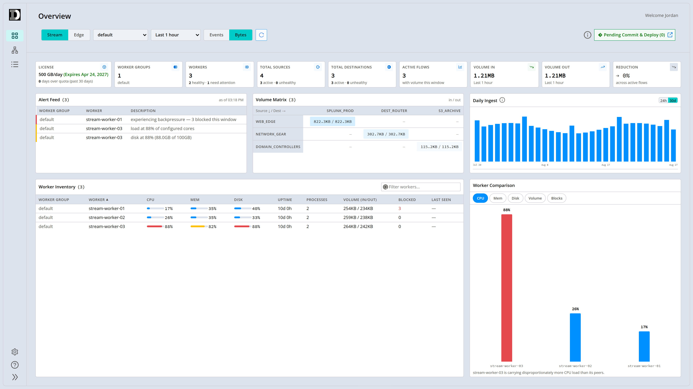
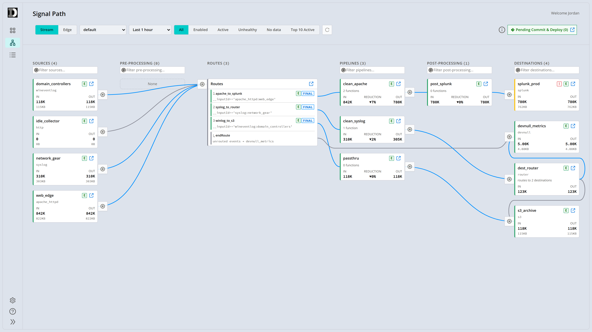
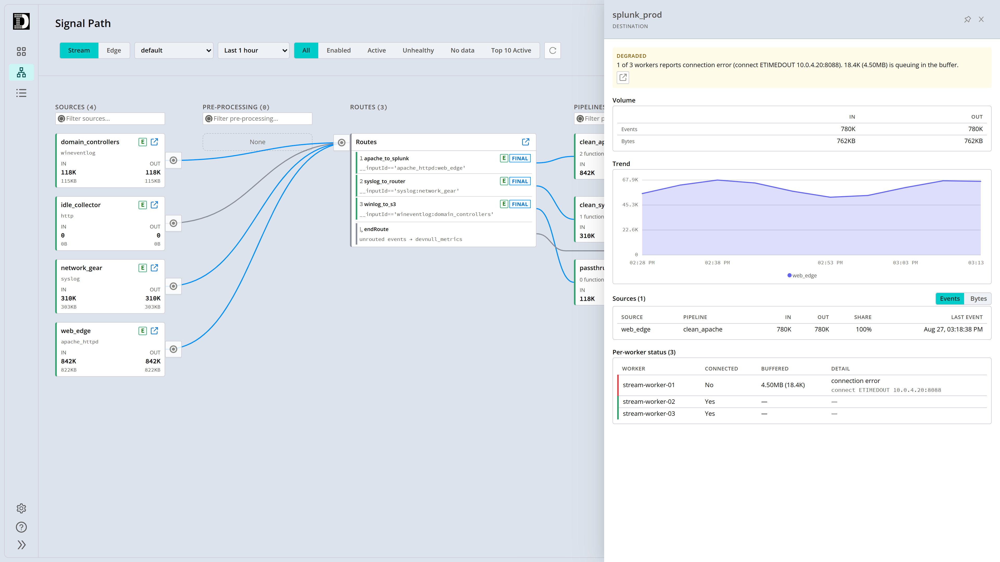
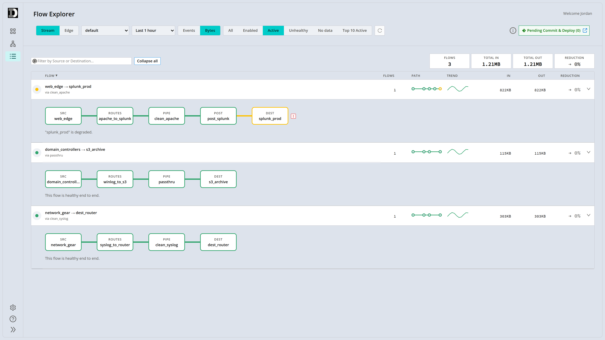

# Data Flow Monitor for Cribl

A single pane of glass for Cribl Stream and Edge data flows, from Source through every Route, Pipeline, and Function to Destination. It's a [Cribl App](https://docs.cribl.io/stream/apps/), installed directly into your Cribl.Cloud organization.

Most people reach for it for one of two reasons: to confirm a flow exists and is wired the way they expect, or to find out where events are dropping, blocking, or degrading before a customer or a downstream team notices.

## Overview

A fleet-level dashboard for whatever is running under a Worker Group or Edge Fleet.

The KPI row up top covers Worker Groups, Workers, Sources, Destinations, active flows, volume in and out, and reduction, all scoped to whichever Worker Group and time range you've picked. Below that, the Alert Feed lists what actually needs attention right now: a worker under backpressure, one running low on disk, a destination that's blocked. The Volume Matrix lays out how much is flowing between each Source and Destination pair, and Daily Ingest tracks your license entitlement against real daily usage, broken down by source, with any over-quota days called out. Worker Inventory lists every worker or node with CPU, memory, and disk as inline bars, sortable by whichever is under the most pressure, and Worker Comparison charts the fleet against each other and flags the worst outlier on its own.

## Signal Path

The core view: a live wiring diagram of one flow from end to end.

Every Source, Pre-Processing Pipeline, Route, Pipeline, Post-Processing stage, and Destination gets its own card, connected the way Cribl actually routes events between them. That includes Output Routers, chained Pipelines, and the implicit fallthrough for anything no rule claims. Cards are colored by real, observed health rather than just configuration, and the lines between them thicken and light up to show which connections are carrying real traffic right now.

Hover any card or Route rule and its entire path lights up (every upstream Source and downstream Destination it touches) while everything unrelated fades out. Click one to open its detail panel:

The detail panel explains itself in plain language before you have to go digging. A destination stuck behind a firewall shows up as "1 of 3 workers reports connection error," not a wall of numbers. From there you get real volume and trend charts, per-source attribution, the exact list of workers currently affected and why, and, for anything with a Persistent Queue, its current backlog. A capture icon sits at each of Cribl's four real checkpoints (before Pre-Processing, before Routes, before Post-Processing, before Destination) so you can pull live sample events without leaving the page.

## Flow Explorer

The same data as Signal Path, laid out as a sortable, searchable table with one row per Source-to-Destination pair.

Each row shows a compact path glyph, a trend sparkline, and how much volume is being reduced (or, occasionally, added to) along the way. Expand a row and the full chain renders inline, stage by stage, with a plain-language note on what's actually happening to that flow. It's the view to reach for when you want to scan a whole environment quickly, filter down to what's unhealthy, or check which paths are busiest without opening the canvas.

## A few other things

Every view has a Stream/Edge toggle, and Signal Path can show a single Worker Group, a single Edge Fleet, or all of them merged into one diagram. Live Capture pulls real, filtered sample events from any of the four checkpoints without leaving Signal Path. The app follows dark and light themes to match your Cribl.Cloud session, with a manual override in Settings if you want one. And nothing on screen is made up: every number comes from a real Cribl API call, there's no demo mode and no synthetic data standing in for the real thing.

## Installing

This is a Cribl App. Install it from your organization's App Library the same way you would any other. It runs inside Cribl's own sandboxed iframe and never handles credentials directly; the platform takes care of authentication.

## License

Licensed under the [Apache License, Version 2.0](LICENSE).
